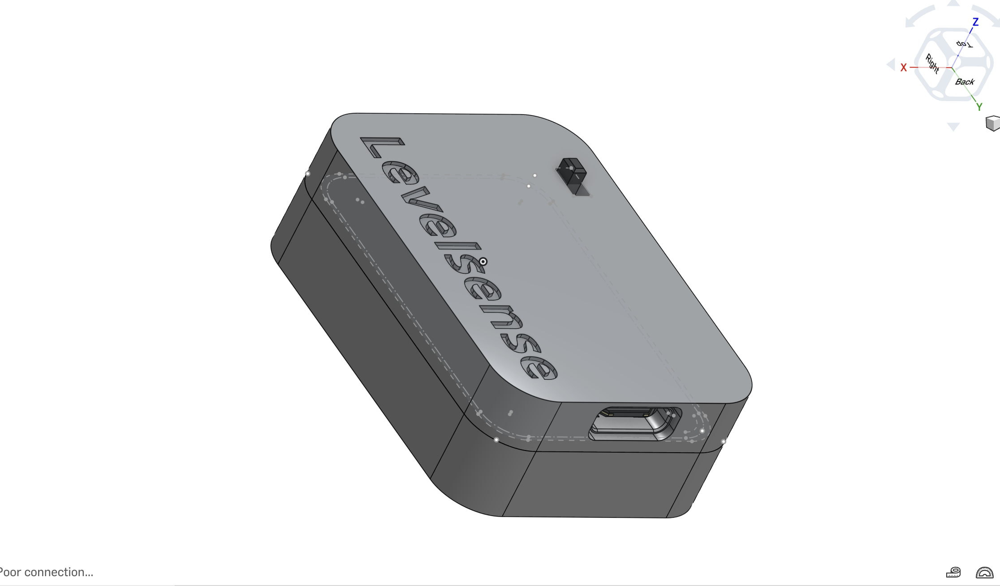
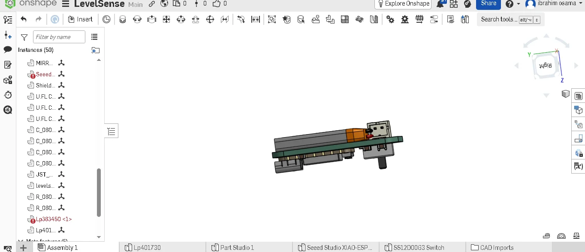

#  LevelSense

**An Iot baseed spirit level that measures pitch and roll with 0.2 degrees precision**

Measure pitch and roll in real time from any phone or computer through a built in web interface.

---

## Overview

Ive often seen my father use a spirit level, but I always thought how could that even be accurate and theres certainly a lot of parallex error. Triggering the small OCD tendency I have, I decided to make Levelsense. 

Levelsense is a digital spirit level made for makers and engineers, mabye even used for industries if developed more. What levelsense does  is measure the acceleration from the mpu6050 and convert this to roll and pitch angle using XIAO ESP32-c3 fast processing speed, which is then tranmistted live to a web page where the user can connect.

The user can select which axis to measure and the BG of the webpage turns greeen when its perfectly alligned.

---

## Features

-  Real time pitch and roll measurements
-  Builtin WiFi web dashboard
-  No mobile app required
-  Rechargeable LiPo battery
-  USB C charging

---
##Onshape link: 

https://cad.onshape.com/documents/eb162f35669f76bf87f9d57e/w/d3793a46ff3fde4e9d2f3516/e/823be988cf47e9833c1df9f3?renderMode=0&uiState=6aaae2133ef3f6a1e4fc79b2

## Hardware

Table 1,,,,,,,
Item,Description,Reference,Footprint,Quantity,Unit Price (USD),Vendor,Purchase Link
XIAO ESP32-C3,Microcontroller,U1,RF_Module:MCU_Seeed_ESP32C3,1,$4.96,Aliexpress,https://www.aliexpress.com/item/1005006979844970.html
MPU6050,Imu sensor,U2,Sensor_Motion:InvenSense_QFN-24_4x4mm_P0.5mm,1,$1.74,Aliexpress,https://www.aliexpress.com/item/1005007580487375.html
Lipo battery ,200mAH 3.7v,-,-,1,(I already have it),-,-
Slide switch ,SPDT switch ,SW1,Button_Switch_THT:SW_Slide-03_Wuerth-WS-SLTV_10x2.5x6.4_P2.54mm,1,(I already have it),-,-
Capacitor SMD,2.2nf,C1,Capacitor_SMD:C_0805_2012Metric,1,(I already have it),-,-
Capacitor SMD,10uf,C3,Capacitor_SMD:C_0805_2012Metric,1,(I already have it),-,-
Capacitor SMD,0.1uf,"C2,C4",Capacitor_SMD:C_0805_2012Metric,2,(I already have it),-,-
Resistor SMD,4.7k,"R1,R2",Capacitor_SMD:C_0805_2012Metric,2,(I already have it),-,-
Jst connector ,2 Pin Jst Ph Connector 2.0mm Pitch,J1,Conn_01x02_Pin,1,$0.072,digilog.pk,https://digilog.pk/products/2-pin-jst-ph-connector-2-0mm-pitch-in-pakistan
Jst connector,2mm Pitch Jst2.0 Plug 2 Pin Extension Wire Connector,-,-,1,$0.14,digilog.pk,https://digilog.pk/products/battery-connector-jst-2mm-in-pakistan
Soldering stand ,Helping Hand Clip Desktop Led Light Magnifier Glass,-,-,1,$4.54,digilog.pk,https://digilog.pk/products/helping-hand-led-light-magnifier-glass-with-soldering-stand-in-pakistan?variant=44490932748566
Solder paste,Mechanic solder paste in syringe,-,-,1,$2.46,digilog.pk,https://digilog.pk/products/mechanic-solder-flux-paste-soldering-tin-cream-sn63-pb37-xg-50-new-packing-from-mechanic-mcn-300-in-pakistan
Twezeers,Curve tip,-,-,1,$0.4,digilog.pk,https://digilog.pk/products/curve-tip-dissecting-forceps-tweezers-in-pakistan?variant=44488063811862
Hot air gun ,Sdl 8610 Dual Temperature Hot Air Gun 1800 Watt,-,-,1,$7.27,digilog.pk,https://digilog.pk/products/dual-temperature-hot-air-gun?variant=44490678010134
Shipping cost,Total,-,-,1,$1.99( digilog )+ $10.02( aliexpress ),-,-
PCB manufacture,Manufacture and shipping included,-,-,5,$2.10 + $34.44(shipping),jlcpcb.com,jlcpcb.com 
Total cost,Cost required for grant,-,-,-,$70.14,-,-

## Software

- Arduino Framework
- PlatformIO
- ESPAsyncWebServer
- MPU6050 Library

---

## Current Status

 **In Development**

This project was made for a hackclub event called macondo and its still in devlopement phase, as I require funding. 

**Pending updates**

-Assembling the gadget and soldering components on the PCB to build the actual product itself.

---

## License

This project is licensed under the **MIT License**.

---

## Acknowledgements

This project is being developed as part of the **Hack Club Ship (Macondo)** program.
